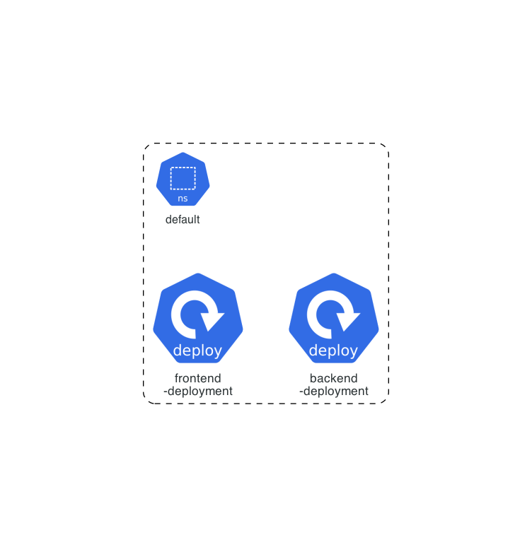

# GEMINI.md - Taskmaster UI

This document provides a comprehensive overview of the Taskmaster UI project, its architecture, and development
workflows. It is intended to be a living document, updated as the project evolves.

## 1. Project Overview

Taskmaster UI is a web-based application designed to manage tasks and projects. It provides a user-friendly interface
for creating, updating, and tracking tasks, with a focus on simplicity and efficiency. The application is built with a
modern technology stack, featuring a React-based frontend and a Node.js backend.

## 2. Application Architecture

The application is composed of two main components: a frontend single-page application (SPA) and a backend API. Both
components are designed to be deployed in a Kubernetes environment.

### 2.1. Kubernetes Architecture Diagram

The following diagram illustrates the Kubernetes architecture of the Taskmaster UI application:



### 2.2. Frontend

The frontend is a React application built with Vite. It is responsible for rendering the user interface and interacting
with the backend API.

- **Framework:** React
- **Build Tool:** Vite
- **Language:** TypeScript
- **Testing:** Vitest, React Testing Library
- **Styling:** CSS (App.css, index.css)

### 2.3. Backend

The backend is a Node.js application built with Express.js. It provides a RESTful API for the frontend to consume.

- **Framework:** Express.js
- **Language:** TypeScript
- **Database:** SQLite
- **Testing:** Jest, Supertest
- **API:** RESTful

## 3. Release Management

The project follows a GitHub-based release management workflow. Releases are created using GitHub Releases, and the
process is as follows:

1. **Create a new branch:** For each new feature or bug fix, create a new branch from the `main` branch.
2. **Develop and test:** Implement the changes and ensure that all tests pass.
3. **Create a pull request:** Open a pull request to merge the changes into the `main` branch.
4. **Code review:** The pull request is reviewed by at least one other developer.
5. **Merge the pull request:** Once the pull request is approved, it is merged into the `main` branch.
6. **Create a release:** A new release is created on GitHub, with a new version number and a summary of the changes.

## 4. Development Workflow

The project uses a set of custom commands to streamline the development workflow. These commands are defined in the
`.gemini/commands` directory and are accessible through the `/project:tm/` namespace in the chat interface.

### 4.1. Getting Started

To get started with the project, follow these steps:

1. **Install dependencies:**
   ```bash
   npm install
   ```
2. **Run the development servers:**
    - **Frontend:**
      ```bash
      npm run dev --workspace=frontend
      ```
    - **Backend:**
      ```bash
      npm run dev --workspace=backend
      ```

### 4.2. Task Management

This project uses Task Master for task management. As an AI assistant, I will autonomously execute `taskmaster` commands
to manage tasks, such as listing, adding, and updating them, based on your requests.

### 4.3. Testing

To run the tests for the frontend and backend, use the following commands:

- **Frontend:**
  ```bash
  npm test --workspace=frontend
  ```
- **Backend:**
  ```bash
  npm test --workspace=backend
  ```

### 4.4. Linting and Formatting

The project uses ESLint for linting and Prettier for formatting. To run the linter and formatter, use the following
commands:

- **Lint:**
  ```bash
  npm run lint --workspace=frontend
  npm run lint --workspace=backend
  ```
- **Format:**
  ```bash
  npm run format --workspace=frontend
  npm run format --workspace=backend
  ```

# Task Master AI - gemini Code Integration Guide

## Essential Commands

### Core Workflow Commands

```bash
# Project Setup
task-master init                                    # Initialize Task Master in current project
task-master parse-prd .taskmaster/docs/prd.txt      # Generate tasks from PRD document
task-master models --setup                        # Configure AI models interactively

# Daily Development Workflow
task-master list                                   # Show all tasks with status
task-master next                                   # Get next available task to work on
task-master show <id>                             # View detailed task information (e.g., task-master show 1.2)
task-master set-status --id=<id> --status=done    # Mark task complete

# Task Management
task-master add-task --prompt="description" --research        # Add new task with AI assistance
task-master expand --id=<id> --research --force              # Break task into subtasks
task-master update-task --id=<id> --prompt="changes"         # Update specific task
task-master update --from=<id> --prompt="changes"            # Update multiple tasks from ID onwards
task-master update-subtask --id=<id> --prompt="notes"        # Add implementation notes to subtask

# Analysis & Planning
task-master analyze-complexity --research          # Analyze task complexity
task-master complexity-report                      # View complexity analysis
task-master expand --all --research               # Expand all eligible tasks

# Dependencies & Organization
task-master add-dependency --id=<id> --depends-on=<id>       # Add task dependency
task-master move --from=<id> --to=<id>                       # Reorganize task hierarchy
task-master validate-dependencies                            # Check for dependency issues
task-master generate                                         # Update task markdown files (usually auto-called)
```

## Key Files & Project Structure

### Core Files

- `.taskmaster/tasks/tasks.json` - Main task data file (auto-managed)
- `.taskmaster/config.json` - AI model configuration (use `task-master models` to modify)
- `.taskmaster/docs/prd.txt` - Product Requirements Document for parsing
- `.taskmaster/tasks/*.txt` - Individual task files (auto-generated from tasks.json)
- `.env` - API keys for CLI usage

### Directory Structure

```
project/
├── .taskmaster/
│   ├── tasks/              # Task files directory
│   │   ├── tasks.json      # Main task database
│   │   ├── task-1.md      # Individual task files
│   │   └── task-2.md
│   ├── docs/              # Documentation directory
│   │   ├── prd.txt        # Product requirements
│   ├── reports/           # Analysis reports directory
│   │   └── task-complexity-report.json
│   ├── templates/         # Template files
│   │   └── example_prd.txt  # Example PRD template
│   └── config.json        # AI models & settings
├── .claude/
│   ├── settings.json      # Claude Code configuration
│   └── commands/         # Custom slash commands
├── .env                  # API keys
├── .mcp.json            # MCP configuration
└── CLAUDE.md            # This file - auto-loaded by Claude Code
```

## MCP Integration

Task Master provides an MCP server that gemini Code can connect to. Configure in `.mcp.json`:

```json
{
  "mcpServers": {
    "task-master-ai": {
      "command": "npx",
      "args": [
        "-y",
        "--package=task-master-ai",
        "task-master-ai"
      ],
      "env": {
        "ANTHROPIC_API_KEY": "your_key_here",
        "PERPLEXITY_API_KEY": "your_key_here",
        "OPENAI_API_KEY": "OPENAI_API_KEY_HERE",
        "GOOGLE_API_KEY": "GOOGLE_API_KEY_HERE",
        "XAI_API_KEY": "XAI_API_KEY_HERE",
        "OPENROUTER_API_KEY": "OPENROUTER_API_KEY_HERE",
        "MISTRAL_API_KEY": "MISTRAL_API_KEY_HERE",
        "AZURE_OPENAI_API_KEY": "AZURE_OPENAI_API_KEY_HERE",
        "OLLAMA_API_KEY": "OLLAMA_API_KEY_HERE"
      }
    }
  }
}
```

### Essential MCP Tools

```javascript
help; // = shows available taskmaster commands
// Project setup
initialize_project; // = task-master init
parse_prd; // = task-master parse-prd

// Daily workflow
get_tasks; // = task-master list
next_task; // = task-master next
get_task; // = task-master show <id>
set_task_status; // = task-master set-status

// Task management
add_task; // = task-master add-task
expand_task; // = task-master expand
update_task; // = task-master update-task
update_subtask; // = task-master update-subtask
update; // = task-master update

// Analysis
analyze_project_complexity; // = task-master analyze-complexity
complexity_report; // = task-master complexity-report
```

## gemini Code Workflow Integration

### Standard Development Workflow

#### 1. Project Initialization

```bash
# Initialize Task Master
task-master init

# Create or obtain PRD, then parse it
task-master parse-prd .taskmaster/docs/prd.txt

# Analyze complexity and expand tasks
task-master analyze-complexity --research
task-master expand --all --research
```

If tasks already exist, another PRD can be parsed (with new information only!) using parse-prd with --append flag. This
will add the generated tasks to the existing list of tasks..

#### 2. Daily Development Loop

```bash
# Start each session
task-master next                           # Find next available task
task-master show <id>                     # Review task details

# During implementation, check in code context into the tasks and subtasks
task-master update-subtask --id=<id> --prompt="implementation notes..."

# Complete tasks
task-master set-status --id=<id> --status=done
```

#### 3. Multi-gemini Workflows

For complex projects, use multiple gemini Code sessions:

```bash
# Terminal 1: Main implementation
cd project && gemini

# Terminal 2: Testing and validation
cd project-test-worktree && gemini

# Terminal 3: Documentation updates
cd project-docs-worktree && gemini
```

## Configuration & Setup

### API Keys Required

At least **one** of these API keys must be configured:

- `ANTHROPIC_API_KEY` (Claude models) - **Recommended**
- `PERPLEXITY_API_KEY` (Research features) - **Highly recommended**
- `OPENAI_API_KEY` (GPT models)
- `GOOGLE_API_KEY` (Gemini models)
- `MISTRAL_API_KEY` (Mistral models)
- `OPENROUTER_API_KEY` (Multiple models)
- `XAI_API_KEY` (Grok models)

An API key is required for any provider used across any of the 3 roles defined in the `models` command.

## Task Structure & IDs

### Task ID Format

- Main tasks: `1`, `2`, `3`, etc.
- Subtasks: `1.1`, `1.2`, `2.1`, etc.
- Sub-subtasks: `1.1.1`, `1.1.2`, etc.

### Task Status Values

- `pending` - Ready to work on
- `in-progress` - Currently being worked on
- `done` - Completed and verified
- `deferred` - Postponed
- `cancelled` - No longer needed
- `blocked` - Waiting on external factors

### Task Fields

```json
{
  "id": "1.2",
  "title": "Implement user authentication",
  "description": "Set up JWT-based auth system",
  "status": "pending",
  "priority": "high",
  "dependencies": [
    "1.1"
  ],
  "details": "Use bcrypt for hashing, JWT for tokens...",
  "testStrategy": "Unit tests for auth functions, integration tests for login flow",
  "subtasks": []
}
```

## gemini Code Best Practices with Task Master

### Iterative Implementation

1. `task-master show <subtask-id>` - Understand requirements
2. Explore codebase and plan implementation
3. `task-master update-subtask --id=<id> --prompt="detailed plan"` - Log plan
4. `task-master set-status --id=<id> --status=in-progress` - Start work
5. Implement code following logged plan
6. `task-master update-subtask --id=<id> --prompt="what worked/didn't work"` - Log progress
7. `task-master set-status --id=<id> --status=done` - Complete task

### Complex Workflows with Checklists

For large migrations or multi-step processes:

1. Create a markdown PRD file describing the new changes: `touch task-migration-checklist.md` (prds can be .txt or .md)
2. Use Taskmaster to parse the new prd with `task-master parse-prd --append` (also available in MCP)
3. Use Taskmaster to expand the newly generated tasks into subtasks. Consdier using `analyze-complexity` with the
   correct --to and --from IDs (the new ids) to identify the ideal subtask amounts for each task. Then expand them.
4. Work through items systematically, checking them off as completed
5. Use `task-master update-subtask` to log progress on each task/subtask and/or updating/researching them before/during
   implementation if getting stuck

### Git Integration

Task Master works well with `gh` CLI:

```bash
# Create PR for completed task
gh pr create --title "Complete task 1.2: User authentication" --body "Implements JWT auth system as specified in task 1.2"

# Reference task in commits
git commit -m "feat: implement JWT auth (task 1.2)"
```

### Parallel Development with Git Worktrees

```bash
# Create worktrees for parallel task development
git worktree add ../project-auth feature/auth-system
git worktree add ../project-api feature/api-refactor

# Run gemini Code in each worktree
cd ../project-auth && gemini    # Terminal 1: Auth work
cd ../project-api && gemini     # Terminal 2: API work
```

## Troubleshooting

### AI Commands Failing

```bash
# Check API keys are configured
cat .env                           # For CLI usage

# Verify model configuration
task-master models

# Test with different model
task-master models --set-fallback gpt-4o-mini
```

### MCP Connection Issues

- Check `.mcp.json` configuration
- Verify Node.js installation
- Use `--mcp-debug` flag when starting gemini Code
- Use CLI as fallback if MCP unavailable

### Task File Sync Issues

```bash
# Regenerate task files from tasks.json
task-master generate

# Fix dependency issues
task-master fix-dependencies
```

DO NOT RE-INITIALIZE. That will not do anything beyond re-adding the same Taskmaster core files.

## Important Notes

### AI-Powered Operations

These commands make AI calls and may take up to a minute:

- `parse_prd` / `task-master parse-prd`
- `analyze_project_complexity` / `task-master analyze-complexity`
- `expand_task` / `task-master expand`
- `expand_all` / `task-master expand --all`
- `add_task` / `task-master add-task`
- `update` / `task-master update`
- `update_task` / `task-master update-task`
- `update_subtask` / `task-master update-subtask`

### File Management

- Never manually edit `tasks.json` - use commands instead
- Never manually edit `.taskmaster/config.json` - use `task-master models`
- Task markdown files in `tasks/` are auto-generated
- Run `task-master generate` after manual changes to tasks.json

### Multi-Task Updates

- Use `update --from=<id>` to update multiple future tasks
- Use `update-task --id=<id>` for single task updates
- Use `update-subtask --id=<id>` for implementation logging

### Research Mode

- Add `--research` flag for research-based AI enhancement
- Requires a research model API key like Perplexity (`PERPLEXITY_API_KEY`) in environment
- Provides more informed task creation and updates
- Recommended for complex technical tasks

---

_This guide ensures gemini Code has immediate access to Task Master's essential functionality for agentic development
workflows._
