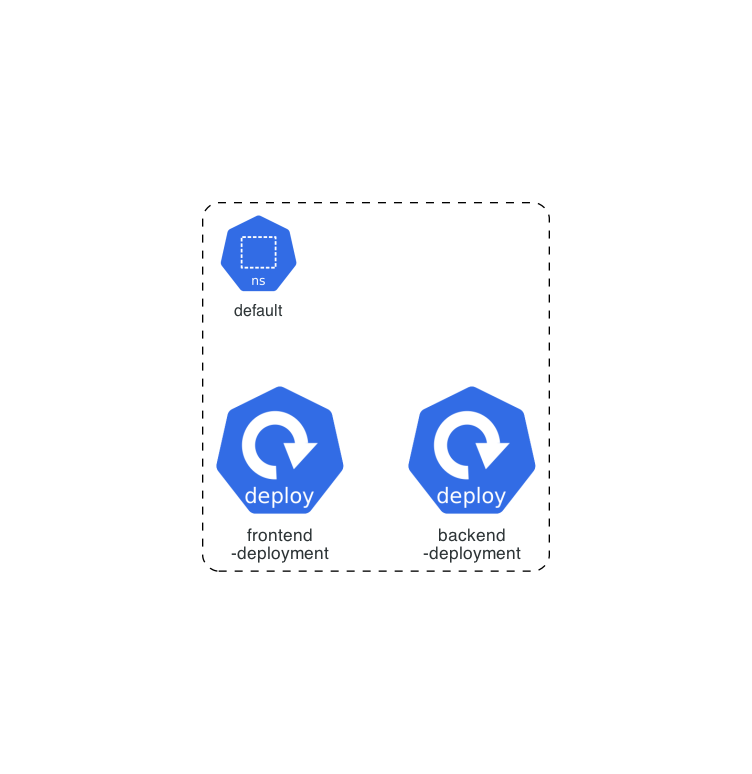

# TaskMaster UI Architecture

## Overview

TaskMaster UI is a web-based application designed to manage tasks and projects with an intuitive interface for creating, updating, and tracking tasks. The application features a modern technology stack with a React-based frontend and a Node.js backend, designed for deployment in a Kubernetes environment.

## System Architecture

### Application Components

The application is composed of two main components:
- **Frontend**: Single-page application (SPA) built with React
- **Backend**: RESTful API server built with Node.js/Express

### Technology Stack

#### Frontend
- **Framework**: React 18 with TypeScript
- **Build Tool**: Vite
- **UI Components**: Custom component library  
- **State Management**: React Context + Hooks
- **Terminal**: xterm.js integration
- **Testing**: Vitest + React Testing Library
- **Styling**: CSS Modules + PostCSS

#### Backend
- **Runtime**: Node.js 18+
- **Framework**: Express.js with TypeScript
- **Database**: SQLite (development), PostgreSQL (production)
- **WebSockets**: Native WebSocket support
- **Testing**: Jest with TypeScript
- **CLI Integration**: TaskMaster AI CLI wrapper

#### Development Tools
- **Package Manager**: pnpm (recommended)
- **Linting**: ESLint with TypeScript rules
- **Formatting**: Prettier
- **Testing**: Jest, Vitest, Playwright
- **Type Checking**: TypeScript strict mode

## Kubernetes Architecture

The application is designed for Kubernetes deployment with the following components:
- Frontend pods serving the React application
- Backend pods providing the API services
- Database persistence layer
- Load balancer for traffic distribution

## Data Flow

### Request Flow
1. User interacts with React frontend
2. Frontend makes API calls to Express backend
3. Backend processes requests and interacts with database
4. Real-time updates sent via WebSocket connections
5. Frontend updates UI with new data

### WebSocket Communication
- Real-time task updates across multiple clients
- File system monitoring for task.json changes
- Terminal session management
- Live collaboration features

## Security Architecture

### Input Validation
- Comprehensive sanitization across all user inputs
- XSS and injection attack prevention
- Content Security Policy (CSP) implementation

### Environment Security
- Secure configuration management
- Environment variable isolation
- API key protection

### API Security
- Rate limiting and request throttling
- Secure request handling
- Authentication and authorization framework

## Performance Considerations

### Frontend Optimization
- Code splitting and lazy loading
- Component memoization
- Bundle size optimization
- Caching strategies

### Backend Optimization
- Database query optimization
- Connection pooling
- Response caching
- Efficient WebSocket handling

### Build Performance
- pnpm for faster package management
- Parallel builds
- Incremental compilation
- Development server hot reloading

## Scalability Design

### Horizontal Scaling
- Stateless backend design
- Load balancer distribution
- Database connection pooling
- Session persistence strategies

### Vertical Scaling
- Resource-efficient code
- Memory optimization
- CPU usage optimization
- I/O efficiency

## Monitoring and Observability

### Health Checks
- API health endpoints
- Database connectivity monitoring
- WebSocket connection status
- Application metrics

### Logging
- Structured logging
- Error tracking
- Performance monitoring
- Audit trails

## Future Architecture Considerations

### Multi-tenant Support
- Data isolation strategies
- Resource allocation
- Security boundaries
- Configuration management

### Microservices Evolution
- Service decomposition strategy
- API gateway implementation
- Service mesh integration
- Event-driven architecture