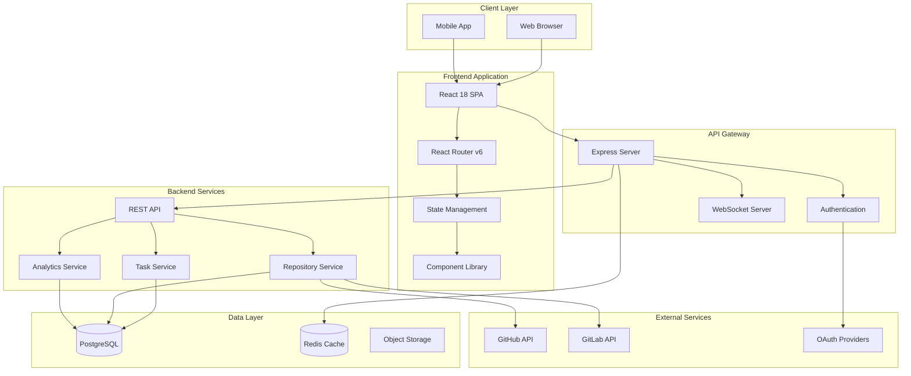

# Architecture Overview

## System Architecture


```mermaid
graph TB
    subgraph "Client Layer"
        Browser[Web Browser]
        Mobile[Mobile App]
    end
    
    subgraph "Frontend Application"
        React[React 18 SPA]
        Router[React Router v6]
        State[State Management]
        UI[Component Library]
    end
    
    subgraph "API Gateway"
        Express[Express Server]
        Auth[Authentication]
        WS[WebSocket Server]
    end
    
    subgraph "Backend Services"
        API[REST API]
        Tasks[Task Service]
        Repos[Repository Service]
        Analytics[Analytics Service]
    end
    
    subgraph "Data Layer"
        PG[(PostgreSQL)]
        Redis[(Redis Cache)]
        S3[Object Storage]
    end
    
    subgraph "External Services"
        GitHub[GitHub API]
        GitLab[GitLab API]
        OAuth[OAuth Providers]
    end
    
    Browser --> React
    Mobile --> React
    React --> Router
    Router --> State
    State --> UI
    React --> Express
    Express --> Auth
    Express --> API
    API --> Tasks
    API --> Repos
    API --> Analytics
    Tasks --> PG
    Repos --> PG
    Analytics --> PG
    Express --> Redis
    Repos --> GitHub
    Repos --> GitLab
    Auth --> OAuth
    Express --> WS
```

## Frontend Architecture

### Technology Stack
- **Framework**: React 18 with TypeScript
- **Build Tool**: Vite 5
- **Styling**: TailwindCSS v4 with custom design system
- **State Management**: React Context + React Query
- **Routing**: React Router v6
- **Testing**: Vitest + React Testing Library

### Component Structure

```
src/
├── components/
│   ├── ui/               # Design system components
│   │   ├── atoms/        # Basic building blocks
│   │   ├── molecules/    # Composite components
│   │   └── organisms/    # Complex components
│   ├── Layout/           # Layout components
│   ├── Auth/             # Authentication components
│   └── Features/         # Feature-specific components
├── contexts/             # React Context providers
├── hooks/                # Custom React hooks
├── pages/                # Route page components
├── services/             # API and external services
└── utils/                # Utility functions
```

### Key Design Patterns

1. **Atomic Design**: Components organized by complexity
2. **Container/Presenter**: Separation of logic and presentation
3. **Custom Hooks**: Reusable business logic
4. **Context Providers**: Global state management
5. **Lazy Loading**: Code splitting for performance

## Backend Architecture

### Technology Stack
- **Runtime**: Node.js 20 LTS
- **Framework**: Express.js
- **ORM**: Prisma
- **Database**: PostgreSQL 15
- **Cache**: Redis
- **WebSockets**: Socket.io

### Service Architecture

```
src/
├── controllers/          # Request handlers
├── services/             # Business logic
├── repositories/         # Data access layer
├── models/               # Data models
├── middleware/           # Express middleware
├── utils/                # Utility functions
└── websocket/            # Real-time features
```

### API Design

- RESTful endpoints following OpenAPI 3.0
- JWT-based authentication
- Rate limiting and request validation
- Comprehensive error handling
- Request/response logging

## Database Schema

### Core Tables

```sql
-- Users and Authentication
CREATE TABLE users (
    id UUID PRIMARY KEY,
    email VARCHAR(255) UNIQUE NOT NULL,
    name VARCHAR(255),
    role VARCHAR(50),
    created_at TIMESTAMP DEFAULT NOW()
);

-- Projects and Tasks
CREATE TABLE projects (
    id UUID PRIMARY KEY,
    name VARCHAR(255) NOT NULL,
    description TEXT,
    owner_id UUID REFERENCES users(id),
    created_at TIMESTAMP DEFAULT NOW()
);

CREATE TABLE tasks (
    id UUID PRIMARY KEY,
    title VARCHAR(255) NOT NULL,
    description TEXT,
    status VARCHAR(50),
    priority VARCHAR(20),
    project_id UUID REFERENCES projects(id),
    assignee_id UUID REFERENCES users(id),
    created_at TIMESTAMP DEFAULT NOW()
);

-- Repository Integration
CREATE TABLE repositories (
    id UUID PRIMARY KEY,
    name VARCHAR(255) NOT NULL,
    url VARCHAR(500),
    provider VARCHAR(50),
    project_id UUID REFERENCES projects(id),
    last_synced_at TIMESTAMP
);
```

## Security Architecture

### Authentication & Authorization
- JWT tokens with refresh token rotation
- OAuth2 integration (Google, GitHub)
- Role-based access control (RBAC)
- Session management with Redis

### Security Measures
- HTTPS enforcement
- CORS configuration
- Rate limiting
- Input validation and sanitization
- SQL injection prevention via Prisma
- XSS protection headers
- CSRF tokens for state-changing operations

## Performance Optimizations

### Frontend
- Code splitting and lazy loading
- Image optimization and lazy loading
- Service Worker for offline capability
- Bundle size optimization
- React.memo and useMemo for rendering

### Backend
- Database query optimization
- Redis caching strategy
- Connection pooling
- Horizontal scaling support
- Background job processing

## Deployment Architecture

### Container Strategy
```yaml
services:
  frontend:
    build: ./packages/frontend
    ports: ["80:80"]
    
  backend:
    build: ./packages/backend
    ports: ["3001:3001"]
    
  postgres:
    image: postgres:15
    volumes: ["pgdata:/var/lib/postgresql/data"]
    
  redis:
    image: redis:7-alpine
```

### Scaling Considerations
- Stateless application design
- Database read replicas
- CDN for static assets
- Load balancer configuration
- Auto-scaling policies

## Monitoring & Observability

### Metrics Collection
- Application performance monitoring
- Error tracking and alerting
- User analytics
- Infrastructure metrics

### Logging Strategy
- Structured JSON logging
- Centralized log aggregation
- Log levels and filtering
- Audit trail for sensitive operations