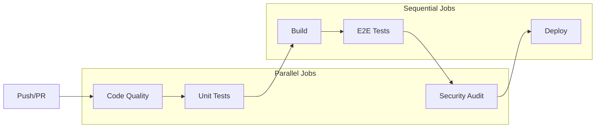

# CI/CD Pipeline Documentation

## Overview

The TaskMaster UI project uses a comprehensive CI/CD pipeline built on GitHub Actions to ensure code quality, automated testing, and reliable deployments.

## Pipeline Architecture



## Workflows

### 1. CI Pipeline (`ci.yml`)

**Triggers:**
- Push to `main`, `master`, `develop` branches
- Pull requests to `main`, `master`

**Jobs:**

#### Code Quality & Linting
- ESLint for code linting
- TypeScript type checking
- Prettier formatting verification
- Runs in parallel for faster feedback

#### Unit Tests
- Frontend tests using Vitest
- Backend tests using Jest
- Code coverage reporting
- Test results archived as artifacts

#### Build
- Frontend production build
- Backend TypeScript compilation
- Docker image building
- Build artifacts uploaded for E2E tests

#### E2E Tests
- Playwright browser tests
- Tests against built artifacts
- PostgreSQL test database
- Test reports and screenshots archived

#### Security Audit
- Dependency vulnerability scanning
- License compliance checking
- SAST (Static Application Security Testing)

### 2. Deployment Pipeline (`deploy.yml`)

**Triggers:**
- Git tags matching `v*.*.*`
- Manual workflow dispatch

**Features:**
- Multi-environment support (dev, staging, production)
- Docker container deployments
- Kubernetes manifests
- Environment-specific configurations
- Health checks and smoke tests

### 3. Release Management (`release.yml`)

**Features:**
- Semantic versioning based on commit messages
- Automated changelog generation
- GitHub releases creation
- Version bumping across workspaces
- Release notes generation

**Commit Message Convention:**
```
feat: Add new feature
fix: Fix bug
docs: Update documentation
style: Code style changes
refactor: Code refactoring
perf: Performance improvements
test: Add tests
build: Build system changes
ci: CI configuration changes
chore: Maintenance tasks
```

### 4. Rollback Capability (`rollback.yml`)

**Features:**
- Manual rollback trigger
- Database backup before rollback
- Version validation
- Health checks post-rollback
- Rollback audit trail

**Usage:**
1. Trigger workflow manually
2. Select environment and target version
3. Provide rollback reason
4. Monitor rollback progress

### 5. Performance Enhancements (`cache-enhancement.yml`)

**Caching Strategies:**
- pnpm store caching
- Build artifacts caching
- Docker layer caching
- Playwright browser caching
- Test results caching
- Turborepo remote caching (optional)

## Environment Variables

### Required Secrets

```yaml
# GitHub Actions
GITHUB_TOKEN: Automatically provided

# NPM (for package publishing)
NPM_TOKEN: Required for semantic-release

# Container Registry
REGISTRY_USERNAME: Docker registry username
REGISTRY_PASSWORD: Docker registry password

# Deployment
KUBE_CONFIG: Base64 encoded kubeconfig
DATABASE_URL: Production database connection

# Monitoring
SENTRY_DSN: Error tracking
DATADOG_API_KEY: APM and monitoring

# Optional
TURBO_TOKEN: Turborepo remote cache
TURBO_TEAM: Turborepo team ID
```

## Best Practices

### 1. Branch Protection

Configure branch protection rules:
- Require PR reviews
- Require status checks to pass
- Dismiss stale PR approvals
- Include administrators

### 2. Performance Optimization

- Use matrix builds for parallel testing
- Implement aggressive caching
- Use Turborepo for incremental builds
- Minimize Docker layers

### 3. Security

- Run security audits on every PR
- Use least-privilege service accounts
- Rotate secrets regularly
- Audit deployment permissions

### 4. Monitoring

- Set up alerts for failed deployments
- Monitor pipeline duration trends
- Track flaky test patterns
- Review security audit results

## Troubleshooting

### Common Issues

#### 1. Cache Misses
```bash
# Clear GitHub Actions cache
gh actions-cache list
gh actions-cache delete <cache-key>
```

#### 2. Flaky E2E Tests
```bash
# Run tests with debug mode
pnpm test:e2e:debug

# Increase timeout
PLAYWRIGHT_TIMEOUT=60000 pnpm test:e2e
```

#### 3. Build Failures
```bash
# Check Node version
node --version  # Should be v20

# Clear local caches
pnpm store prune
rm -rf node_modules
pnpm install
```

#### 4. Deployment Issues
```bash
# Verify deployment status
kubectl get deployments -n taskmaster
kubectl describe deployment frontend -n taskmaster

# Check logs
kubectl logs -f deployment/frontend -n taskmaster
```

## Maintenance

### Weekly Tasks
- Review and merge Dependabot PRs
- Check for workflow updates
- Monitor CI/CD metrics

### Monthly Tasks
- Rotate deployment secrets
- Update GitHub Actions versions
- Review and optimize caching
- Audit deployment permissions

### Quarterly Tasks
- Major dependency updates
- Security audit review
- Performance baseline updates
- Disaster recovery testing

## Metrics and KPIs

Track these metrics:
- Average pipeline duration: < 10 minutes
- Build success rate: > 95%
- Test flakiness: < 2%
- Deployment success rate: > 99%
- Time to recovery: < 30 minutes

## Future Improvements

1. **Blue-Green Deployments**
   - Zero-downtime deployments
   - Automated canary releases
   - A/B testing infrastructure

2. **Advanced Monitoring**
   - Real User Monitoring (RUM)
   - Synthetic monitoring
   - Performance budgets

3. **Enhanced Security**
   - Runtime security scanning
   - Dependency auto-updates
   - Compliance automation

4. **Developer Experience**
   - PR preview environments
   - Automated performance reports
   - Visual regression testing