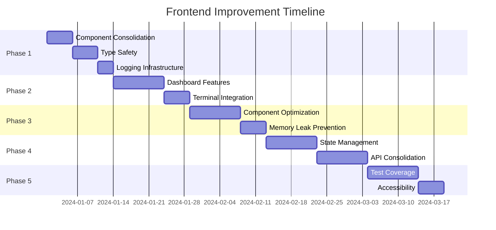

# Frontend Improvement and Optimization PRD

## Executive Summary

This PRD outlines a comprehensive improvement plan for the TaskMaster UI frontend package based on a thorough code analysis. The plan addresses technical debt, performance optimizations, code quality improvements, and feature completions that will enhance maintainability, user experience, and developer productivity.

## Current State Analysis

### Key Findings

1. **Technical Debt**: 19 TODO items, 20+ `any` types, duplicate components
2. **Code Quality**: Console.log statements, inconsistent patterns, missing optimizations
3. **Performance**: No memoization, large components, potential memory leaks
4. **Architecture**: Duplicate API patterns, no centralized state management
5. **Testing**: Limited test coverage, missing integration tests

## Proposed Improvements

### Phase 1: Critical Fixes (1-2 weeks)

#### 1.1 Component Consolidation
**Problem**: Duplicate Card and FormField components causing confusion and maintenance overhead

**Solution**:
- Merge Card components into a single, flexible component
- Deprecate `/components/ui/atoms/Card.tsx` in favor of the molecules version
- Create a migration guide for existing usages

**Tasks**:
```
1. Audit all Card component usages
2. Create unified Card component with all features
3. Implement drag-and-drop as an optional prop
4. Update all imports across the codebase
5. Remove deprecated components
```

#### 1.2 Type Safety Enhancement
**Problem**: 20+ instances of `any` type usage reducing type safety

**Solution**:
- Replace all `any` types with proper TypeScript interfaces
- Create shared type definitions for common patterns
- Implement strict TypeScript configuration

**Tasks**:
```
1. Create types/api.ts for all API response types
2. Create types/events.ts for WebSocket event types
3. Update services/taskService.ts with proper types
4. Update services/websocket.ts with typed events
5. Enable strict mode in tsconfig.json
```

#### 1.3 Logging Infrastructure
**Problem**: Console.log statements throughout the codebase

**Solution**:
- Implement comprehensive logging using existing logger utility
- Add log levels and environment-based filtering
- Integrate with monitoring service

**Tasks**:
```
1. Configure logger for different environments
2. Replace all console.* statements
3. Add Sentry integration for error monitoring
4. Implement log aggregation for production
```

### Phase 2: Feature Completion (2-3 weeks)

#### 2.1 Dashboard Functionality
**Problem**: Multiple unimplemented features in ModernDashboardView

**Solution**:
Complete all pending functionality with proper API integration

**Features to Implement**:
```
1. Create Task Modal
   - Task creation form
   - Priority and assignee selection
   - Due date picker
   - API integration

2. Reports View
   - Task completion trends
   - Team productivity metrics
   - Export functionality

3. Team Management
   - Add/remove members
   - Role assignment
   - Permission management

4. Data Export
   - CSV/JSON export options
   - Custom date ranges
   - Filtered data export
```

#### 2.2 Terminal Integration
**Problem**: Incomplete terminal command execution

**Solution**:
- Implement direct command execution in EnhancedTaskMasterTerminal
- Add command history and autocomplete
- Improve error handling and feedback

**Tasks**:
```
1. Implement executeCommand function
2. Add command validation
3. Create command history storage
4. Implement autocomplete functionality
```

### Phase 3: Performance Optimization (2-3 weeks)

#### 3.1 Component Optimization
**Problem**: No memoization, large components, frequent re-renders

**Solution**:
- Implement React.memo for pure components
- Use useMemo/useCallback for expensive operations
- Split large components

**Tasks**:
```
1. Add React.memo to all pure components
2. Optimize TaskBoard component (split into smaller parts)
3. Implement virtual scrolling for large lists
4. Add lazy loading for routes
5. Optimize bundle size with code splitting
```

#### 3.2 Memory Leak Prevention
**Problem**: WebSocket subscriptions and event listeners not cleaned up

**Solution**:
- Implement proper cleanup in useEffect hooks
- Create custom hooks for subscriptions
- Add memory leak detection in development

**Tasks**:
```
1. Audit all useEffect hooks
2. Add cleanup functions for subscriptions
3. Create useWebSocket custom hook
4. Implement memory leak warnings
```

### Phase 4: Architecture Improvements (3-4 weeks)

#### 4.1 State Management
**Problem**: Multiple contexts, prop drilling, no centralized state

**Solution**:
- Implement Zustand for global state management
- Reduce context providers
- Create clear state boundaries

**Architecture**:
```
stores/
├── authStore.ts
├── projectStore.ts
├── taskStore.ts
├── uiStore.ts
└── index.ts
```

#### 4.2 API Layer Consolidation
**Problem**: Duplicate API patterns, inconsistent error handling

**Solution**:
- Create unified API client with interceptors
- Implement consistent error handling
- Add request/response transformation

**Tasks**:
```
1. Create ApiClient class with interceptors
2. Implement automatic retry logic
3. Add request queuing for offline support
4. Unify error response format
5. Add request caching layer
```

### Phase 5: Quality Assurance (2-3 weeks)

#### 5.1 Test Coverage
**Problem**: Limited test coverage, missing integration tests

**Solution**:
- Achieve 80% test coverage
- Add integration tests for critical flows
- Implement E2E tests with Playwright

**Test Plan**:
```
1. Unit tests for all utilities and hooks
2. Component tests with React Testing Library
3. Integration tests for user workflows
4. E2E tests for critical paths
5. Performance tests for key metrics
```

#### 5.2 Accessibility Improvements
**Problem**: Missing ARIA labels, inconsistent focus management

**Solution**:
- Complete WCAG 2.1 AA compliance
- Add automated accessibility testing
- Implement screen reader testing

**Tasks**:
```
1. Add ARIA labels to all interactive elements
2. Implement skip links on all pages
3. Ensure keyboard navigation works everywhere
4. Add accessibility testing to CI/CD
5. Create accessibility documentation
```

## Implementation Timeline



## Success Metrics

### Performance Metrics
- Initial load time < 3 seconds
- Time to interactive < 5 seconds
- Lighthouse score > 90
- Bundle size < 500KB (gzipped)

### Code Quality Metrics
- TypeScript coverage: 100%
- Test coverage: > 80%
- Zero console.log statements
- No duplicate components

### User Experience Metrics
- Task creation time < 30 seconds
- Zero accessibility violations
- Keyboard navigation for all features
- Responsive on all devices

## Risk Mitigation

### Technical Risks
1. **Breaking Changes**: Use feature flags for gradual rollout
2. **Performance Regression**: Implement performance budgets
3. **State Migration**: Create migration scripts for existing data

### Process Risks
1. **Timeline Delays**: Build in 20% buffer time
2. **Scope Creep**: Lock requirements after each phase
3. **Resource Constraints**: Prioritize critical fixes first

## Migration Strategy

### Component Migration
```typescript
// Before
import { Card } from '@/components/ui/atoms/Card'

// After
import { Card } from '@/components/ui/molecules/Card'
// With deprecation notice and automated migration script
```

### State Migration
```typescript
// Before: Multiple contexts
const { user } = useAuthContext()
const { project } = useProjectContext()

// After: Centralized store
const { user, project } = useStore()
```

## Dependencies

### New Dependencies
- Zustand (state management)
- Sentry (error monitoring)
- Playwright (E2E testing)

### Removed Dependencies
- Remove unused packages identified during audit

## Conclusion

This improvement plan addresses critical technical debt while enhancing user experience and developer productivity. The phased approach ensures continuous delivery of value while maintaining system stability. Each phase builds upon the previous one, creating a solid foundation for future development.

## Appendix

### File List for Major Changes

#### Duplicate Components to Remove
- `/components/ui/atoms/Card.tsx`
- `/components/ui/molecules/FormFieldWithFocus.tsx`

#### Components Requiring Optimization
- `/pages/TaskBoard.tsx` (857+ lines)
- `/components/Views/ModernDashboardView.tsx`
- `/components/Terminal/EnhancedTaskMasterTerminal.tsx`

#### High-Priority TODO Locations
- `/pages/Onboarding.tsx:28,37`
- `/utils/logger.ts:65`
- `/components/Views/ModernDashboardView.tsx:322-358`