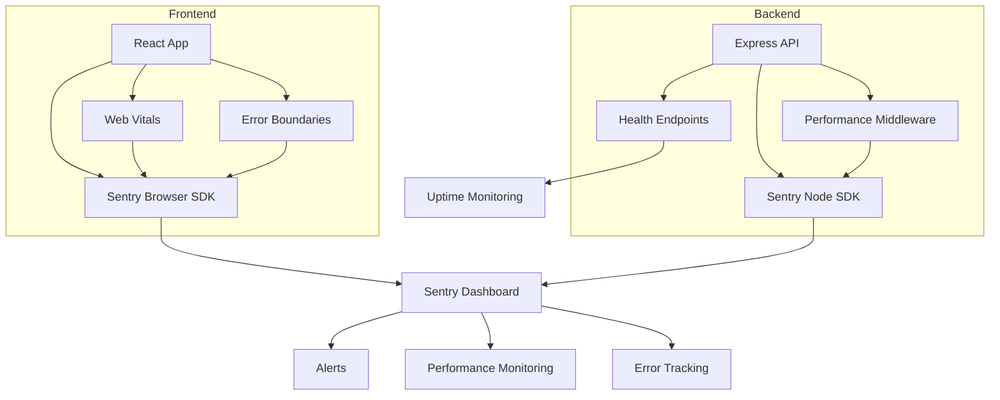

# Monitoring and Alerting Documentation

## Overview

TaskMaster UI implements comprehensive monitoring and error tracking using Sentry for both frontend and backend applications, along with custom performance monitoring and health checks.

## Architecture



## Sentry Configuration

### Frontend Setup

1. **Environment Variables**
```env
# .env.local
VITE_SENTRY_DSN=https://your-key@sentry.io/project-id
VITE_APP_ENV=production
VITE_APP_VERSION=1.0.0
```

2. **Initialization**
```typescript
// src/main.tsx
import { initSentry } from './config/sentry'
import { initPerformanceMonitoring } from './services/performanceMonitoring'

// Initialize before React
initSentry()
initPerformanceMonitoring()
```

3. **Error Boundaries**
```tsx
// App.tsx
import { ErrorBoundary } from './components/ErrorBoundary'

function App() {
  return (
    <ErrorBoundary level="app">
      <Router>
        <Routes>
          {/* Your routes */}
        </Routes>
      </Router>
    </ErrorBoundary>
  )
}
```

### Backend Setup

1. **Environment Variables**
```env
# .env
SENTRY_DSN=https://your-key@sentry.io/project-id
NODE_ENV=production
APP_VERSION=1.0.0
```

2. **Initialization**
```typescript
// src/index.ts
import { initSentry, setupSentryMiddleware, setupSentryErrorHandler } from './config/sentry'

// Initialize Sentry
initSentry(app)

// Setup middleware (before routes)
setupSentryMiddleware(app)

// Your routes here...

// Setup error handler (after routes)
setupSentryErrorHandler(app)
```

## Health Check Endpoints

### Available Endpoints

| Endpoint | Description | Response |
|----------|-------------|----------|
| `GET /health` | Basic health check | `{ status: 'OK', timestamp, service }` |
| `GET /api/health` | API health check | `{ status, version, timestamp }` |
| `GET /api/health/system` | Comprehensive system health | `{ status, components: { database, secrets, ssl } }` |
| `GET /api/health/secrets` | Secrets manager health | `{ status, providers, cache }` |
| `GET /api/health/ssl` | SSL configuration health | `{ status, ssl, certificate }` |

### Health Check Implementation

```bash
# Check all health endpoints
curl http://localhost:3000/health
curl http://localhost:3000/api/health
curl http://localhost:3000/api/health/system
curl http://localhost:3000/api/health/secrets
curl http://localhost:3000/api/health/ssl
```

## Performance Monitoring

### Web Vitals Tracking

The application tracks key Web Vitals metrics:

- **LCP** (Largest Contentful Paint): < 2.5s
- **FID** (First Input Delay): < 100ms
- **CLS** (Cumulative Layout Shift): < 0.1
- **FCP** (First Contentful Paint): < 1.8s
- **TTFB** (Time to First Byte): < 800ms

### Custom Performance Metrics

```typescript
// Track page load
metrics.pageLoad.start()
// ... page loads
metrics.pageLoad.end()

// Track API calls
metrics.apiCall.start('/api/tasks')
// ... API call
metrics.apiCall.end('/api/tasks')

// Track component renders
metrics.componentRender.start('TaskBoard')
// ... component renders
metrics.componentRender.end('TaskBoard')

// Track user interactions
metrics.interaction.start('drag-task')
// ... interaction
metrics.interaction.end('drag-task')
```

### Performance Budgets

```typescript
const budgets = {
  pageLoad: 3000,        // 3 seconds
  domContentLoaded: 1500, // 1.5 seconds
  firstPaint: 1000,      // 1 second
}
```

## Alert Configuration

### Sentry Alerts

1. **Error Rate Alert**
   - Threshold: > 1% error rate
   - Window: 5 minutes
   - Action: Notify #alerts-channel

2. **Performance Alert**
   - Threshold: LCP > 4 seconds
   - Window: 10 minutes
   - Action: Notify engineering team

3. **Crash Rate Alert**
   - Threshold: > 0.5% crash rate
   - Window: 1 hour
   - Action: Page on-call engineer

### Custom Alerts

```typescript
// Frontend crash alert
if (window.addEventListener) {
  window.addEventListener('unhandledrejection', event => {
    Sentry.captureException(event.reason, {
      tags: { type: 'unhandled_promise_rejection' }
    })
  })
}

// Backend critical error alert
class CriticalError extends Error {
  constructor(message: string) {
    super(message)
    Sentry.captureException(this, {
      level: 'fatal',
      tags: { alert: 'critical' }
    })
  }
}
```

## Dashboard Setup

### Key Metrics Dashboard

```yaml
# Grafana dashboard config
panels:
  - title: "Error Rate"
    query: "rate(errors_total[5m])"
    alert:
      condition: "> 0.01"
      
  - title: "Response Time P95"
    query: "histogram_quantile(0.95, response_time_bucket)"
    alert:
      condition: "> 1000"
      
  - title: "Active Users"
    query: "active_users_total"
    
  - title: "API Requests/sec"
    query: "rate(api_requests_total[1m])"
```

### Real User Monitoring (RUM)

Track real user experience:

```typescript
// Session recording configuration
new Sentry.Replay({
  maskAllText: true,
  blockAllMedia: false,
  sessionSampleRate: 0.1,    // 10% of sessions
  errorSampleRate: 1.0,      // 100% of error sessions
})
```

## Debugging Production Issues

### 1. Error Investigation

```bash
# View error details in Sentry
# Error ID is provided in ErrorBoundary UI

# Backend logs
kubectl logs -f deployment/backend -n taskmaster

# Frontend console (if user provides)
# Check browser DevTools console
```

### 2. Performance Investigation

```javascript
// Enable performance profiling
localStorage.setItem('debug:performance', 'true')

// View performance marks
performance.getEntriesByType('measure').forEach(entry => {
  console.log(`${entry.name}: ${entry.duration}ms`)
})
```

### 3. Health Check Debugging

```bash
# Full system health check
curl -v http://api.taskmaster.app/api/health/system | jq

# Database connection test
curl http://api.taskmaster.app/api/health/system | jq '.components.database'

# SSL certificate check
curl http://api.taskmaster.app/api/health/ssl | jq '.certificate'
```

## Monitoring Checklist

### Daily Monitoring
- [ ] Check Sentry dashboard for new errors
- [ ] Review error rate trends
- [ ] Check Web Vitals scores
- [ ] Monitor API response times

### Weekly Monitoring
- [ ] Review performance degradation trends
- [ ] Check error patterns and grouping
- [ ] Review user session recordings
- [ ] Update alert thresholds if needed

### Monthly Monitoring
- [ ] Analyze performance budget violations
- [ ] Review and clean up ignored errors
- [ ] Update monitoring documentation
- [ ] Performance optimization planning

## Integration with CI/CD

### Pre-deployment Checks

```yaml
# GitHub Actions workflow
- name: Check Sentry CLI
  run: |
    npx @sentry/cli releases new ${{ github.sha }}
    npx @sentry/cli releases set-commits ${{ github.sha }} --auto

- name: Upload source maps
  run: |
    npx @sentry/cli releases files ${{ github.sha }} upload-sourcemaps ./dist
```

### Post-deployment Verification

```yaml
- name: Verify deployment health
  run: |
    # Wait for deployment
    sleep 30
    
    # Check health endpoints
    curl -f https://api.taskmaster.app/health
    curl -f https://api.taskmaster.app/api/health/system
    
    # Mark release as deployed
    npx @sentry/cli releases finalize ${{ github.sha }}
    npx @sentry/cli releases deploys ${{ github.sha }} new -e production
```

## Troubleshooting

### Common Issues

1. **Sentry not receiving events**
   - Check DSN configuration
   - Verify network connectivity
   - Check browser extensions blocking requests
   - Review `beforeSend` filters

2. **Performance metrics missing**
   - Ensure Performance Observer API support
   - Check sampling rates
   - Verify transaction names

3. **Health checks failing**
   - Check database connectivity
   - Verify environment variables
   - Review SSL certificate validity
   - Check secrets manager access

### Debug Mode

Enable debug logging:

```typescript
// Frontend
localStorage.setItem('debug:sentry', 'true')
Sentry.init({ debug: true })

// Backend
SENTRY_DEBUG=true node dist/index.js
```

## Cost Optimization

### Sentry Usage Optimization

1. **Sampling Strategy**
   ```typescript
   tracesSampleRate: process.env.NODE_ENV === 'production' ? 0.1 : 1.0
   ```

2. **Error Filtering**
   ```typescript
   beforeSend(event) {
     // Filter out known non-issues
     if (event.exception?.values?.[0]?.type === 'NetworkError') {
       return null
     }
     return event
   }
   ```

3. **Session Replay Sampling**
   ```typescript
   replaysSessionSampleRate: 0.1,  // Only 10% of sessions
   replaysOnErrorSampleRate: 1.0,  // But 100% with errors
   ```