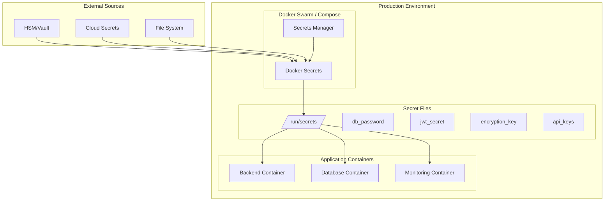

# Production Secrets Management

TaskMaster UI implements enterprise-grade secrets management for production deployments using Docker Secrets and file-based secret providers.

## Overview

### Security Architecture



## Secret Types

### Application Secrets

| Secret | Purpose | Generation | Rotation |
|--------|---------|------------|----------|
| `jwt_secret` | JWT token signing | Auto-generated 32+ chars | Monthly |
| `encryption_key` | Data encryption | Auto-generated 32+ chars | Quarterly |
| `db_password` | Database access | Auto-generated strong | Monthly |

### External Service Secrets

| Secret | Service | Format | Validation |
|--------|---------|--------|------------|
| `github_token` | GitHub API | `ghp_*` or `github_pat_*` | API call test |
| `slack_bot_token` | Slack notifications | `xoxb-*` | Bot info API |
| `anthropic_api_key` | AI services | `sk-ant-api03-*` | Model list API |

### Monitoring Secrets

| Secret | Service | Purpose | Default |
|--------|---------|---------|---------|
| `grafana_password` | Grafana admin | Dashboard access | Auto-generated |

## Implementation

### Docker Secrets Configuration

```yaml
# docker-compose.prod.yml
services:
  backend:
    secrets:
      - db_password
      - jwt_secret
      - encryption_key
      - source: github_token
        target: github_token
        mode: 0400
    environment:
      - DOCKER_SECRETS=true
      - SECRETS_PROVIDER=file

secrets:
  db_password:
    file: ./secrets/db_password.txt
  jwt_secret:
    file: ./secrets/jwt_secret.txt
  # ... additional secrets
```

### Application Integration

The backend application automatically detects and uses file-based secrets in production:

```typescript
// Automatic provider selection
const secretsManager = getSecretsManager();

// In production with DOCKER_SECRETS=true:
// - Provider: file
// - Path: /run/secrets/
// - Fallback: environment variables

const secrets = await getApplicationSecrets();
```

## Setup Guide

### 1. Initialize Secrets

```bash
# Create secret files with proper permissions
./scripts/setup-secrets.sh

# Verify setup
ls -la secrets/
```

### 2. Configure External Services

```bash
# GitHub integration
echo "your_github_token_here" > secrets/github_token.txt

# Slack notifications
echo "your_slack_bot_token_here" > secrets/slack_bot_token.txt

# AI services
echo "your_anthropic_api_key_here" > secrets/anthropic_api_key.txt
```

### 3. Validate Configuration

```bash
# Check all secrets are properly configured
./scripts/setup-secrets.sh validate

# Test with Docker Compose
docker-compose -f docker-compose.yml -f docker-compose.prod.yml config
```

### 4. Deploy

```bash
# Start production environment
docker-compose -f docker-compose.yml -f docker-compose.prod.yml up -d

# Verify secrets are loaded
docker-compose exec backend ls -la /run/secrets/
```

## Security Best Practices

### File Permissions

```bash
# Secrets directory
chmod 700 secrets/

# Individual secret files
chmod 600 secrets/*.txt

# Ownership (production)
chown root:root secrets/
```

### Access Control

1. **Container Level**: Secrets mounted read-only
2. **Application Level**: Secrets cached with TTL
3. **Network Level**: Internal Docker network only
4. **Storage Level**: Encrypted volumes (optional)

### Audit & Monitoring

```bash
# Monitor secret access
docker-compose exec backend grep -i secret /app/logs/app.log

# Health check includes secret validation
curl http://localhost:3001/health/secrets
```

## Secret Rotation

### Automated Rotation

```bash
#!/bin/bash
# Example rotation script

# Generate new secret
NEW_SECRET=$(openssl rand -base64 32)

# Update secret file
echo "$NEW_SECRET" > secrets/jwt_secret.txt

# Restart services to reload secrets
docker-compose restart backend
```

### Manual Rotation Process

1. **Generate new secret**
2. **Update secret file**
3. **Restart affected services**
4. **Validate application health**
5. **Update monitoring dashboards**

## Deployment Environments

### Development

```bash
# Use environment variables
NODE_ENV=development
SECRETS_PROVIDER=env
```

### Staging

```bash
# Use staging-specific secrets
NODE_ENV=staging
DOCKER_SECRETS=true
SECRETS_PROVIDER=file
SECRETS_PATH=/run/secrets
```

### Production

```bash
# Use production secrets with additional security
NODE_ENV=production
DOCKER_SECRETS=true
SECRETS_PROVIDER=file
SECRETS_PATH=/run/secrets
SECRETS_CACHE_TTL=300000
```

## Integration with External Systems

### HashiCorp Vault

```yaml
# Future enhancement
secrets:
  db_password:
    external: true
    external_name: vault://secret/taskmaster/db_password
```

### Cloud Providers

```yaml
# AWS Secrets Manager
secrets:
  api_key:
    external: true
    external_name: arn:aws:secretsmanager:region:account:secret:name

# Google Secret Manager  
secrets:
  api_key:
    external: true
    external_name: projects/PROJECT/secrets/SECRET/versions/latest

# Azure Key Vault
secrets:
  api_key:
    external: true
    external_name: https://vault.vault.azure.net/secrets/secret-name
```

## Troubleshooting

### Common Issues

1. **Secret Not Found**
   ```bash
   # Check file exists and permissions
   ls -la secrets/
   
   # Verify mount in container
   docker-compose exec backend ls -la /run/secrets/
   ```

2. **Permission Denied**
   ```bash
   # Fix permissions
   chmod 600 secrets/*.txt
   chmod 700 secrets/
   ```

3. **Invalid Secret Format**
   ```bash
   # Validate secret content
   cat secrets/jwt_secret.txt | wc -c  # Should be 32+ chars
   ```

### Health Checks

```bash
# Application health with secrets
curl http://localhost:3001/health/secrets

# Docker secrets status
docker secret ls

# Container secret mounts
docker-compose exec backend mount | grep secrets
```

### Debugging

```bash
# Enable debug logging
SECRETS_DEBUG=true docker-compose up

# Check secret loading
docker-compose logs backend | grep -i secret
```

## Compliance & Standards

### Security Standards

- **PCI DSS**: Secure secret storage and access
- **SOC 2**: Audit trail and access controls  
- **ISO 27001**: Information security management
- **NIST**: Cryptographic standards compliance

### Audit Requirements

- Secret access logging
- Regular rotation schedules
- Access control reviews
- Encryption in transit and at rest

## Migration Guide

### From Environment Variables

1. **Audit current environment variables**
2. **Create corresponding secret files**
3. **Update Docker Compose configuration**
4. **Test in staging environment**
5. **Deploy to production**

### From Legacy Systems

1. **Export existing secrets securely**
2. **Validate secret formats**
3. **Import to new secret management**
4. **Update application configuration**
5. **Verify functionality**

This secrets management system provides enterprise-grade security while maintaining operational simplicity for the TaskMaster UI platform.