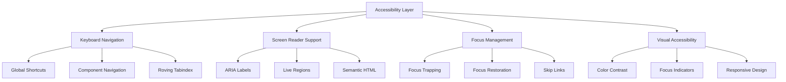

# Accessibility Implementation Guide

## Overview

This guide documents the accessibility features implemented in TaskMaster UI and provides guidelines for maintaining WCAG 2.1 AA compliance in future development.

## Architecture

### Core Accessibility Systems



## Implementation Details

### 1. Keyboard Navigation System

#### Global Shortcuts Hook
```typescript
// Usage in any component
import { useGlobalKeyboardShortcuts } from '@/hooks/useKeyboardShortcuts'

function MyComponent() {
  useGlobalKeyboardShortcuts()
  // Component now responds to global shortcuts
}
```

#### Available Shortcuts
- `Cmd/Ctrl + K`: Open command palette
- `Cmd/Ctrl + /`: Show keyboard shortcuts
- `G then H`: Go to home
- `G then R`: Go to repositories
- `G then T`: Go to tasks
- `G then S`: Go to settings

#### Custom Component Shortcuts
```typescript
const shortcuts = [
  {
    key: 'ctrl+s',
    description: 'Save changes',
    handler: () => saveData(),
    preventDefault: true,
  }
]
useKeyboardShortcuts(shortcuts)
```

### 2. Focus Management

#### Route Focus Management
Automatically manages focus when navigating between routes:
```typescript
// Automatically included in AppLayout
useRouteFocusManagement()
```

#### Focus Restoration
For modals and temporary focus changes:
```typescript
const { saveFocus, restoreFocus } = useFocusRestore()

// Before opening modal
saveFocus()

// After closing modal
restoreFocus()
```

#### Focus Trapping
For modals and overlays:
```typescript
<FocusTrap active={isOpen}>
  <Modal>
    {/* Focus cycles within modal */}
  </Modal>
</FocusTrap>
```

### 3. Screen Reader Support

#### Semantic HTML Structure
```typescript
<main>
  <h1>Page Title</h1>
  <nav aria-label="Breadcrumb">
    {/* Breadcrumb navigation */}
  </nav>
  <section aria-labelledby="section-title">
    <h2 id="section-title">Section Title</h2>
    {/* Section content */}
  </section>
</main>
```

#### Live Regions
```typescript
// For status updates
<AriaLiveRegion 
  message="Task saved successfully"
  politeness="polite"
/>

// For errors
<AriaLiveRegion 
  message="Error: Failed to save"
  politeness="assertive"
/>
```

#### Descriptive Labels
```typescript
// Icon buttons
<button aria-label="Delete task: Fix login bug">
  <TrashIcon />
</button>

// Form fields
<FormField label="Email Address" required>
  <input 
    type="email"
    aria-describedby="email-error email-help"
  />
</FormField>
```

### 4. Component Patterns

#### Accessible Modal
```typescript
<Modal
  open={isOpen}
  onOpenChange={setIsOpen}
  aria-labelledby="modal-title"
>
  <Modal.Header>
    <Modal.Title id="modal-title">Confirm Action</Modal.Title>
    <Modal.Close aria-label="Close dialog" />
  </Modal.Header>
  <Modal.Body>
    {/* Content */}
  </Modal.Body>
</Modal>
```

#### Accessible Tabs
```typescript
<Tabs defaultValue="tab1" orientation="horizontal">
  <Tabs.List aria-label="Settings sections">
    <Tabs.Trigger value="tab1">General</Tabs.Trigger>
    <Tabs.Trigger value="tab2">Security</Tabs.Trigger>
  </Tabs.List>
  <Tabs.Content value="tab1">
    {/* Tab panel content */}
  </Tabs.Content>
</Tabs>
```

#### Accessible Forms
```typescript
<form onSubmit={handleSubmit}>
  <FormFieldWithFocus
    label="Username"
    error={errors.username}
    required
    focusOnError
  >
    <input
      type="text"
      aria-invalid={!!errors.username}
      aria-describedby={errors.username ? "username-error" : undefined}
    />
  </FormFieldWithFocus>
</form>
```

## Best Practices

### 1. Color and Contrast

#### Text Contrast Requirements
- Normal text: 4.5:1 ratio
- Large text (18pt+): 3:1 ratio
- UI components: 3:1 ratio

#### Implementation
```css
/* Good contrast examples */
.text-primary {
  color: #1a202c; /* On white: 15.3:1 */
}

.text-secondary {
  color: #4a5568; /* On white: 7.1:1 */
}

.button-primary {
  background: #3182ce; /* White text: 5.1:1 */
  color: white;
}
```

### 2. Focus Indicators

#### Visible Focus Styles
```css
/* Base focus style */
.focus-visible:focus {
  outline: 2px solid #3182ce;
  outline-offset: 2px;
}

/* High contrast mode support */
@media (prefers-contrast: high) {
  .focus-visible:focus {
    outline-width: 3px;
  }
}
```

### 3. Touch Targets

#### Minimum Sizes
- Touch targets: 44x44 pixels minimum
- Spacing between targets: 8px minimum

```typescript
// Button with proper touch target
<button className="min-h-[44px] min-w-[44px] p-2">
  Click me
</button>
```

### 4. Loading and Progress

#### Loading States
```typescript
<div aria-busy="true" aria-label="Loading repositories">
  <Spinner />
  <span className="sr-only">Loading repositories...</span>
</div>
```

#### Progress Indicators
```typescript
<div
  role="progressbar"
  aria-valuenow={progress}
  aria-valuemin={0}
  aria-valuemax={100}
  aria-label="Upload progress"
>
  {progress}%
</div>
```

## Testing Checklist

### Manual Testing

#### Keyboard Testing
- [ ] Tab through all interactive elements
- [ ] Verify logical tab order
- [ ] Test all keyboard shortcuts
- [ ] Ensure no keyboard traps
- [ ] Verify focus indicators are visible

#### Screen Reader Testing
- [ ] Navigate with headings (H key)
- [ ] Navigate with landmarks
- [ ] Verify all images have alt text
- [ ] Check form labels and errors
- [ ] Test dynamic content announcements

#### Visual Testing
- [ ] Zoom to 200% - no horizontal scroll
- [ ] Check color contrast ratios
- [ ] Disable CSS - content still readable
- [ ] Test with Windows High Contrast mode

### Automated Testing

#### Unit Tests
```typescript
// Example accessibility test
it('should have no accessibility violations', async () => {
  const { container } = render(<MyComponent />)
  const results = await axe(container)
  expect(results).toHaveNoViolations()
})
```

#### Integration Tests
```typescript
// Keyboard navigation test
it('should navigate with arrow keys', async () => {
  const user = userEvent.setup()
  render(<Navigation />)
  
  const firstItem = screen.getAllByRole('link')[0]
  firstItem.focus()
  
  await user.keyboard('{ArrowDown}')
  expect(screen.getAllByRole('link')[1]).toHaveFocus()
})
```

## Common Pitfalls and Solutions

### 1. Missing Labels
```typescript
// ❌ Bad - no accessible name
<button><Icon /></button>

// ✅ Good - has accessible name
<button aria-label="Save document">
  <Icon />
</button>
```

### 2. Poor Error Handling
```typescript
// ❌ Bad - error not associated
<input type="email" />
<div>Invalid email</div>

// ✅ Good - error properly associated
<input 
  type="email" 
  aria-invalid="true"
  aria-describedby="email-error" 
/>
<div id="email-error" role="alert">Invalid email</div>
```

### 3. Focus Management Issues
```typescript
// ❌ Bad - focus not restored
function openModal() {
  setIsOpen(true)
}

// ✅ Good - focus properly managed
function openModal() {
  saveFocus()
  setIsOpen(true)
}

function closeModal() {
  setIsOpen(false)
  restoreFocus()
}
```

### 4. Inadequate Loading States
```typescript
// ❌ Bad - no indication for screen readers
<div>
  <Spinner />
</div>

// ✅ Good - proper ARIA attributes
<div aria-busy="true" aria-label="Loading data">
  <Spinner />
  <span className="sr-only">Loading data...</span>
</div>
```

## Resources

### Documentation
- [WCAG 2.1 Guidelines](https://www.w3.org/WAI/WCAG21/quickref/)
- [ARIA Authoring Practices](https://www.w3.org/WAI/ARIA/apg/)
- [WebAIM Resources](https://webaim.org/resources/)

### Testing Tools
- [axe DevTools](https://www.deque.com/axe/devtools/)
- [WAVE Browser Extension](https://wave.webaim.org/extension/)
- [Contrast Ratio Checker](https://webaim.org/resources/contrastchecker/)

### Screen Readers
- [NVDA (Windows)](https://www.nvaccess.org/)
- [JAWS (Windows)](https://www.freedomscientific.com/products/software/jaws/)
- [VoiceOver (macOS/iOS)](https://www.apple.com/accessibility/voiceover/)
- [TalkBack (Android)](https://support.google.com/accessibility/android/answer/6007100)

## Maintenance Guidelines

### Code Review Checklist
- [ ] All images have appropriate alt text
- [ ] Interactive elements have accessible names
- [ ] Form inputs have associated labels
- [ ] Error messages are properly associated
- [ ] Focus order is logical
- [ ] Color contrast meets requirements
- [ ] Keyboard navigation works properly
- [ ] ARIA attributes are correctly used

### Continuous Improvement
1. Regular accessibility audits (quarterly)
2. User feedback incorporation
3. Dependency updates for accessibility fixes
4. Team training on accessibility best practices
5. Automated testing in CI/CD pipeline

---

*This guide is a living document and should be updated as new accessibility features are implemented or standards evolve.*